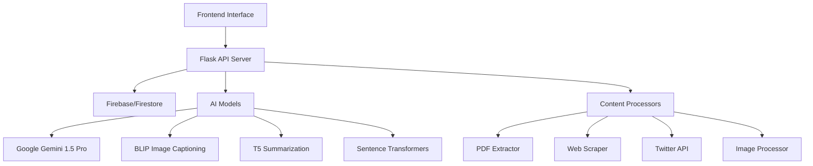

<div align="center">

# 🧠 Mindvault

### *Your Personal AI-Powered Knowledge Management System*

[](https://python.org)
[](https://flask.palletsprojects.com)
[](https://firebase.google.com)
[](https://ai.google.dev)

*Store, organize, and retrieve information from any source using the power of AI*

---

</div>

## ✨ Features

<table>
<tr>
<td width="50%">

### 🔍 **Semantic Search**

* Natural language queries across your knowledge base
* AI-powered similarity matching
* Instant retrieval of relevant information

### 📚 **Multi-Source Input**

* 🌐 Web pages and articles
* 🐦 Twitter/X posts
* 📄 PDF documents
* 🖼️ Images with auto-captioning

</td>
<td width="50%">

### 🤖 **AI-Powered Analysis**

* Automatic content summarization
* Image captioning using BLIP model
* Fallback to Gemini AI for new queries

### 📅 **Calendar Integration**

* Chronological organization
* Visual timeline of your knowledge
* Easy browsing by date

</td>
</tr>
</table>

---

## 🏗️ Technical Architecture



### 🛠️ **Core Technologies**

| Component    | Technology            | Purpose                           |
| ------------ | --------------------- | --------------------------------- |
| **Backend**  | Flask + Python        | API server and business logic     |
| **Database** | Firebase Firestore    | User data and knowledge storage   |
| **Search**   | Sentence Transformers | Semantic similarity matching      |
| **AI**       | Google Gemini 1.5 Pro | Intelligent response generation   |
| **Vision**   | BLIP Model            | Automatic image captioning        |
| **NLP**      | NLTK + T5             | Text processing and summarization |

---

## 🚀 Quick Start

### 📋 Prerequisites

* 🐍 **Python 3.8+**
* 🔥 **Firebase account** with Firestore database
* 🤖 **Google AI API key**

### ⚡ Installation

1. **Clone the repository**

   ```bash
   git clone https://github.com/yourusername/mindvault.git
   cd mindvault
   ```
2. **Install dependencies**

   ```bash
   pip install -r requirements.txt
   ```
3. **Set up Firebase credentials**

   ```bash
   mkdir firebase
   # Download your Firebase service account key
   # Save as: firebase/mindvault-[PROJECT-ID]-firebase-adminsdk.json
   ```
4. **Configure environment variables**

   ```bash
   export GOOGLE_AI_API_KEY="your_google_ai_api_key"
   export TWITTER_BEARER_TOKEN="your_twitter_bearer_token"  # Optional
   ```
5. **Start the server**

   ```bash
   python server.py
   ```

🎉 **Your Mindvault is now running on** `http://localhost:5000`

---

## 💡 Usage Guide

### 📥 **Adding Content to Your Vault**

<table>
<tr>
<td width="33%">

#### 🌐 **Web Content**

Submit URLs to automatically extract and summarize articles, blog posts, and web pages.

</td>
<td width="33%">

#### 🖼️ **Images**

Upload images for automatic captioning and visual content storage.

</td>
<td width="33%">

#### ✍️ **Manual Entries**

Add personal notes, thoughts, and custom content directly.

</td>
</tr>
</table>

### 🔍 **Retrieving Information**

* 💬 **Natural Language Queries**: Ask questions in plain English
* 📅 **Calendar View**: Browse your knowledge chronologically
* 🤖 **AI Fallback**: Get intelligent responses when information isn't stored

---

## 📡 API Reference

### 🔍 **Search Endpoint**

```http
POST /search
Content-Type: application/json

{
  "query": "your search query",
  "user_id": "firebase_user_id"
}
```

**Response:**

```json
{
  "score": 0.85,
  "description": "Found content description",
  "input_data": "source_url",
  "timestamp": "2024-01-15T10:30:00Z"
}
```

### 💬 **Chat Endpoint**

```http
POST /chat
Content-Type: application/json

{
  "query": "What did I save about machine learning?",
  "user_id": "firebase_user_id"
}
```

**Response:**

```json
{
  "answer": "Here's what you saved about machine learning...",
  "from_db": true,
  "metadata": {
    "similarity_score": 0.92,
    "source": "article_url"
  }
}
```

### 🖼️ **Image Upload Endpoint**

```http
POST /api/upload
Content-Type: multipart/form-data

Form Data:
- image: [file]
```

**Response:**

````json
{
  "description": "A beautiful sunset over mountains with orange and pink clouds"
}
```\`

### 🔖 **Bookmark Generation Endpoint**
```http
POST /api/generate/bookmark
Content-Type: application/json

{
  "prompt": "https://example.com/interesting-article"
}
````

**Response:**

```json
{
  "description": "Automatically generated summary of the article content..."
}
```

---

## 🔧 Configuration

### 🔐 **Environment Variables**

| Variable               | Description           | Required   |
| ---------------------- | --------------------- | ---------- |
| `GOOGLE_AI_API_KEY`    | Google Gemini API key | ✅ Yes      |
| `TWITTER_BEARER_TOKEN` | Twitter API access    | ❌ Optional |

### ⚙️ **Firebase Setup**

1. Create a new Firebase project
2. Enable Firestore database
3. Generate service account credentials
4. Download the JSON key file
5. Place in `firebase/` directory

---

## 📁 Project Structure

```
mindvault/
├── server.py                 # Main Flask application
├── requirements.txt          # Python dependencies
├── firebase/                 # Firebase credentials
│   └── mindvault-xxx-firebase-adminsdk.json
├── temp/                     # Temporary file storage
├── static/                   # Static assets
├── templates/                # HTML templates
└── README.md                 # This file
```

---

## 🔍 Key Components

### 🧠 **AI Models Integration**

* **Google Gemini 1.5 Pro**: Primary AI for generating responses
* **Sentence Transformers**: Semantic search and similarity matching
* **BLIP Model**: Automatic image captioning
* **T5 Summarization**: Content summarization for bookmarks

### 🗄️ **Data Processing Pipeline**

1. **Content Ingestion**: URLs, images, PDFs, manual entries
2. **Text Extraction**: Clean and process content
3. **Embedding Generation**: Create semantic vectors
4. **Storage**: Save to Firestore with metadata
5. **Retrieval**: Semantic search with similarity scoring

### 🔒 **Security Features**

* Firebase authentication integration
* File upload validation and sanitization
* Rate limiting for API endpoints
* Temporary file cleanup
* CORS configuration for web security

---

## 🎯 Roadmap

* 📱 Mobile app development
* 🔄 Real-time sync across devices
* 🏷️ Advanced tagging system
* 📊 Analytics and insights
* 🔗 Integration with more platforms
* 🎨 Custom themes and layouts
* 🔍 Advanced search filters
* 📈 Usage statistics dashboard

---

## 🐛 Troubleshooting

### Common Issues

**🔥 Firebase Connection Error**

```bash
# Ensure your Firebase credentials are correctly placed
ls firebase/mindvault-*-firebase-adminsdk.json
```

**🤖 AI API Rate Limits**

* Check your Google AI API quotas
* Implement exponential backoff for retries

**📁 File Upload Issues**

* Verify file size limits (5MB max)
* Check supported file extensions
* Ensure temp directory permissions

**🔍 Search Not Working**

* Verify user exists in Firestore
* Check embedding model initialization
* Review similarity threshold settings

---

## 🤝 Contributing

We welcome contributions! Please see our [Contributing Guidelines](CONTRIBUTING.md) for details.

### Development Setup

1. 🍴 Fork the repository
2. 🌿 Create a feature branch

   ```bash
   git checkout -b feature/amazing-feature
   ```
3. 💻 Make your changes
4. ✅ Add tests
5. 📝 Commit your changes

   ```bash
   git commit -m 'Add amazing feature'
   ```
6. 🚀 Push to the branch

   ```bash
   git push origin feature/amazing-feature
   ```
7. 📋 Submit a pull request

### Code Style

* Follow PEP 8 for Python code
* Use meaningful variable names
* Add docstrings for functions
* Include error handling

---


## 🙏 Acknowledgments

* 🤗 **Hugging Face** for the amazing transformer models
* 🔥 **Firebase** for reliable cloud infrastructure
* 🤖 **Google AI** for the powerful Gemini model
* 🐍 **Python Community** for the excellent libraries
* 📚 **Open Source Contributors** who make projects like this possible

---

## 📞 Support

Need help? Here are your options:

* 📖 **Documentation**: Check this README and inline code comments
* 🐛 **Bug Reports**: [Create an issue](https://github.com/yourusername/mindvault/issues)
* 💡 **Feature Requests**: [Request a feature](https://github.com/yourusername/mindvault/issues)
* 💬 **Discussions**: [Join the conversation](https://github.com/yourusername/mindvault/discussions)
* 📧 **Email**: [support@mindvault.dev](mailto:support@mindvault.dev)

---

<div align="center">

### 💖 **Made with love for knowledge enthusiasts**

*If you find Mindvault helpful, please consider giving it a ⭐ on GitHub!*

**Version 1.0.0** | **Last Updated: January 2024**

[🐛 Report Bug](https://github.com/yourusername/mindvault/issues) • [✨ Request Feature](https://github.com/yourusername/mindvault/issues) • [💬 Discussions](https://github.com/yourusername/mindvault/discussions)

---

*"Knowledge is power, but organized knowledge is wisdom."*

</div>
